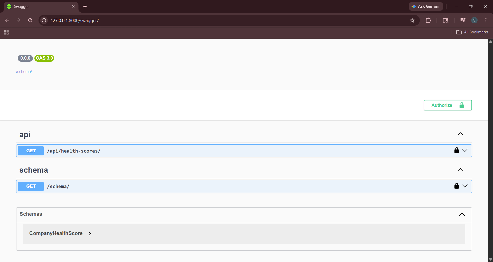

# Financial Intelligence System for Nifty 100 Companies

## Project Overview

A full-stack financial intelligence platform built for India's top 100 publicly listed companies (Nifty 100).

The system combines:
- Power BI dashboards
- Python ETL pipelines
- Machine Learning health scoring
- PostgreSQL data warehouse
- Django REST APIs
- Financial analytics notebooks

This project simulates a production-grade analytics platform used by investors, analysts, and financial institutions.

---

# Features

## Power BI Dashboards
- 01 | Executive Overview
- 02 | Company Deep Dive Suite (Balance Sheet Health, Cash Flow Analysis, Company Deep Dive, Growth & Return)
- 03 | Sector Comparison
- 04 | Valuation Modeler (Intrinsic Value, Multiples Analysis, Scenario Sensitivity Matrix)
- 05 | Credit Risk Analyzer (Solvency & Liquidity, Debt Service Coverage, Credit Risk Scorecard)
- 06 | Debt Leverage Suite (Risk & Health Matrix)
- 07 | Dividend Returns Modeler (Decomposition, Extended Analysis)

## Python Analytics
- Exploratory Data Analysis (EDA)
- Financial ratio analysis
- Correlation heatmaps
- Trend analysis
- Company health scoring

## ETL Pipelines
- SQL dump extraction
- Data cleaning & transformation
- Standardized financial datasets
- PostgreSQL warehouse loading

## Django REST API
- Company financial APIs
- Health score APIs
- Swagger/OpenAPI documentation
- JSON responses for external integrations

---

# Technology Stack

| Category | Technologies |
|---|---|
| Backend | Django, Django REST Framework |
| Database | PostgreSQL |
| ETL | Python, pandas, SQLAlchemy |
| ML/Analytics | scikit-learn, numpy, scipy |
| Visualization | Power BI, matplotlib, seaborn |
| API Docs | drf-spectacular / Swagger |
| Notebook | Jupyter Notebook |
| Containerization | Docker |

---

# Project Architecture

```bash
Raw SQL Dump
    ↓
ETL Pipelines
    ↓
Clean CSVs
    ↓
PostgreSQL Warehouse
    ↓
Django APIs
    ↓
Power BI Dashboards
```
---

# Folder Structure

```bash
financial-system/
│
├── backend/
│   ├── api/
│   ├── backend/
│   ├── manage.py
│   └── requirements.txt
│
├── data/
│   ├── raw/
│   └── clean/
│
├── etl/
│   ├── 01_extract_from_mysql.py
│   ├── 02_clean_and_transform.py
│   ├── 03_load_to_warehouse.py
│   └── eda_financial_analysis.ipynb
│
├── powerbi/
│   ├── dashboard 1/
│   │   └── executive_overview.png
│   ├── dashboard 2/
│   │   ├── balance sheet health.png
│   │   ├── cash flow analysis.png
│   │   ├── company deep dive.png
│   │   └── growth and return analysis.png
│   ├── dashboard 3/
│   │   └── industry sector benchmarking.png
│   ├── dashboard 4/
│   │   ├── intrinsic value summary.png
│   │   ├── multiples analysis.png
│   │   └── scenario sensitivity matrix.png
│   ├── dashboard 5/
│   │   ├── credit risk scorecard.png
│   │   ├── debt service coverage.png
│   │   └── solvency and liquidity.png
│   ├── dashboard 6/
│   │   └── risk and health matrix.png
│   └── dashboard 7/
│       ├── decomposition.png
│       └── extended analysis.png
│
├── screenshots/
│   ├── swagger/
│   └── jupyter/
│
├── Dockerfile
├── docker-compose.yml
├── requirements.txt
└── README.md
```

---

# API Endpoints

| Endpoint | Description |
|---|---|
| `/api/health-scores/` | Company health scores |
| `/swagger/` | Swagger API documentation |
| `/schema/` | OpenAPI schema |

---

# Machine Learning Health Scoring

The project computes a financial health score using:
- Profitability metrics
- Growth metrics
- Leverage ratios
- Cash flow analysis
- ROE and ROCE
- Financial trends

### Health Labels
- Excellent
- Good
- Average
- Weak
- Poor

---

# Dashboard Screenshots

## 01 | Executive Overview


## 02 | Company Deep Dive Suite


## 03 | Sector Comparison


## 04 | Corporate Valuation Modeler


## 05 | Credit Risk Analyzer


## 06 | Debt Leverage Suite


## 07 | Dividend Returns Modeler


---

# Swagger API Documentation



---

# Jupyter Notebook Analysis

An interactive Exploratory Data Analysis (EDA) notebook (`etl/eda_financial_analysis.ipynb`) was built to dynamically query our financial warehouse data. It includes interactive widgets for real-time sector and company breakdown analysis.

### Features:
- **Dynamic Dropdowns**: Multi-level filtering by Sector and individual Company symbols.
- **Financial Metrics Engine**: Real-time evaluation of compounded sales growth, profit margins, and health trends.
- **Data Visualizations**: Built using `matplotlib` and `seaborn` for clean financial chart generation.


---

# Setup Instructions

## Clone Repository

```bash
git clone YOUR_GITHUB_REPO_URL
```

## Move Into Project Folder

```bash
cd financial-system
```

## Install Dependencies

```bash
pip install -r requirements.txt
```

## Run Django Server

```bash
cd backend
python manage.py runserver
```

## Open Swagger Documentation

```bash
http://127.0.0.1:8000/swagger/
```

---

# Docker Support

Docker configuration files are included for containerized deployment.

## Docker Files Included
- Dockerfile
- docker-compose.yml

---

# Future Improvements

- Celery background tasks
- Redis caching
- Authentication system
- Cloud deployment
- Real-time stock APIs

---

# Author

## Saanvi Praharaj
```
